# ttfx — text animations in native Swift

Bring terminal text effects into a native Swift gallery, a command-line tool, and a side-by-side comparison app.
This **work-in-progress port of Rust ttfx** carries forward the animations of Python [TerminalTextEffects](https://github.com/ChrisBuilds/terminaltexteffects), with Rust as its local reference.

## Executive brief

- **37 native Swift effects** to explore with your own text, seed, and canvas.
- **A live SwiftUI/Metal gallery** and a Swift CLI, plus a macOS app comparing Rust terminal, Swift Metal, optional Swift CLI, and optional SwiftUI recordings.
- **Evidence you can inspect:** real animations below and sampled full-run frame comparisons against Rust.

The current focus is native Apple-platform exploration and verification. The gallery has macOS and iOS Simulator launch paths; the comparison app runs on macOS. Swift is not yet a replacement for the production Rust terminal binary: complete CLI parity and Windows/Linux portability remain pending.

## See it in motion

[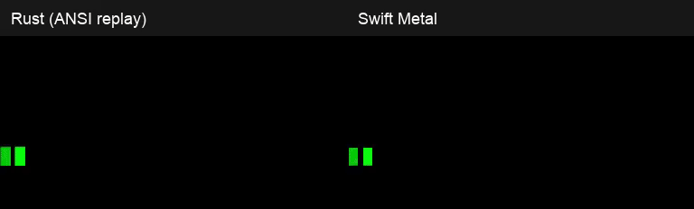](docs/swift-port/comparisons/decrypt.mp4)

**Rust left · Swift Metal right.** A six-second excerpt of real captured output at its original speed.
[Full decrypt video](docs/swift-port/comparisons/decrypt.mp4) · [All 37 inline comparisons](#all-37-rust-versus-metal-comparisons).
These recordings illustrate a seeded sample, not universal or pixel-exact parity.

## Try it

From the repository root, with the Swift toolchain installed:

```sh
swift build --product ttfx
printf 'Swift\nTTE' | swift run ttfx -- --canvas-width 12 --canvas-height 6 print
```

For the visual gallery, follow the [Swift quick start](docs/swift-port/README.md#gallery-app-macos-and-ios-simulator).
For four-track playback, follow the [comparison guide](docs/swift-port/video-comparison.md).
Build instructions, validation, captured evidence, and Rust background are collected in the [technical reference](#technical-reference) below.

## All 37 Rust versus Metal comparisons

**Rust left · Swift Metal right**, displayed inline below. Each labeled GIF is the first **up to six seconds**
of a real captured animation at its original **25 fps**, looping only for the preview. Shorter effects are shown
in full; longer effects have a secondary full-length MP4 link. These are seeded visual samples, not universal
parity proof. [Provenance, scope, and regeneration](docs/swift-port/comparisons/README.md).

### beams

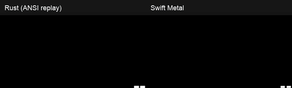

[Full beams comparison](docs/swift-port/comparisons/beams.mp4) · Inline preview: up to 6 seconds, original speed.

### binarypath

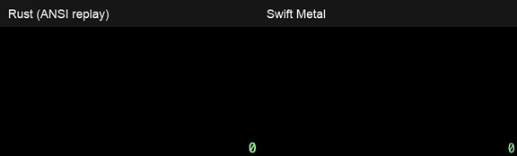

[Full binarypath comparison](docs/swift-port/comparisons/binarypath.mp4) · Inline preview: up to 6 seconds, original speed.

### blackhole

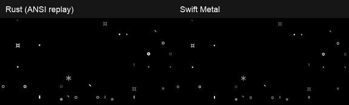

[Full blackhole comparison](docs/swift-port/comparisons/blackhole.mp4) · Inline preview: up to 6 seconds, original speed.

### bouncyballs

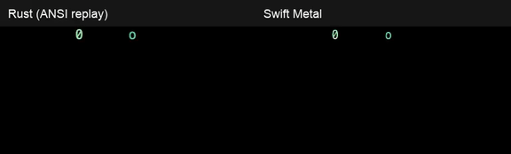

[Full bouncyballs comparison](docs/swift-port/comparisons/bouncyballs.mp4) · Inline preview: up to 6 seconds, original speed.

### bubbles


[Full bubbles comparison](docs/swift-port/comparisons/bubbles.mp4) · Inline preview: up to 6 seconds, original speed.

### burn

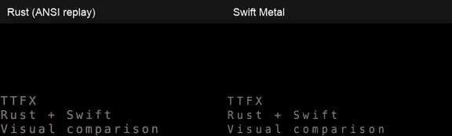

[Full burn comparison](docs/swift-port/comparisons/burn.mp4) · Inline preview: up to 6 seconds, original speed.

### colorshift

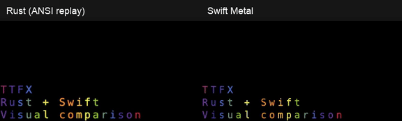

[Full colorshift comparison](docs/swift-port/comparisons/colorshift.mp4) · Inline preview: up to 6 seconds, original speed.

### crumble

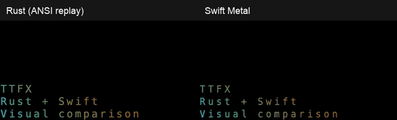

[Full crumble comparison](docs/swift-port/comparisons/crumble.mp4) · Inline preview: up to 6 seconds, original speed.

### decrypt


[Full decrypt comparison](docs/swift-port/comparisons/decrypt.mp4) · Inline preview: up to 6 seconds, original speed.

### errorcorrect

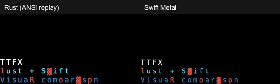

[Full errorcorrect comparison](docs/swift-port/comparisons/errorcorrect.mp4) · Inline preview: up to 6 seconds, original speed.

### expand

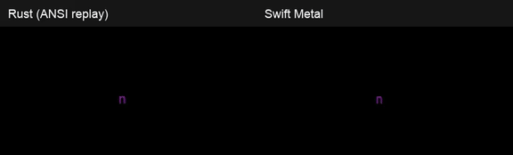

[Full expand comparison](docs/swift-port/comparisons/expand.mp4) · Inline preview: up to 6 seconds, original speed.

### fireworks


[Full fireworks comparison](docs/swift-port/comparisons/fireworks.mp4) · Inline preview: up to 6 seconds, original speed.

### highlight

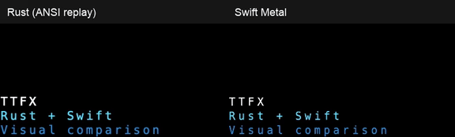

[Full highlight comparison](docs/swift-port/comparisons/highlight.mp4) · Inline preview: up to 6 seconds, original speed.

### laseretch

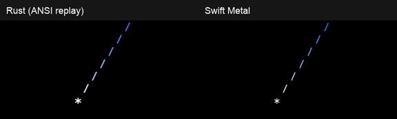

[Full laseretch comparison](docs/swift-port/comparisons/laseretch.mp4) · Inline preview: up to 6 seconds, original speed.

### matrix

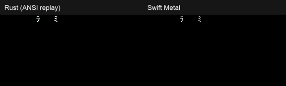

[Full matrix comparison](docs/swift-port/comparisons/matrix.mp4) · Inline preview: up to 6 seconds, original speed.

### middleout

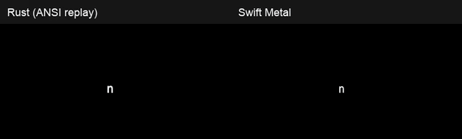

[Full middleout comparison](docs/swift-port/comparisons/middleout.mp4) · Inline preview: up to 6 seconds, original speed.

### orbittingvolley

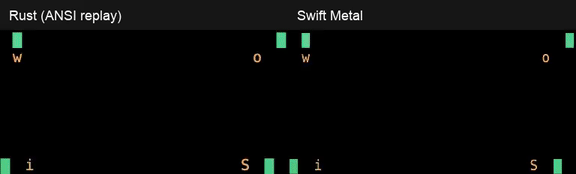

[Full orbittingvolley comparison](docs/swift-port/comparisons/orbittingvolley.mp4) · Inline preview: up to 6 seconds, original speed.

### overflow

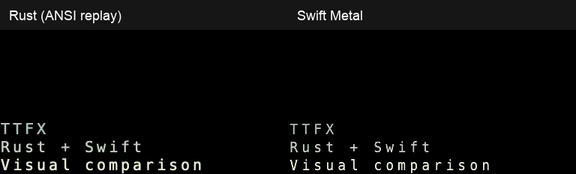

[Full overflow comparison](docs/swift-port/comparisons/overflow.mp4) · Inline preview: up to 6 seconds, original speed.

### pour

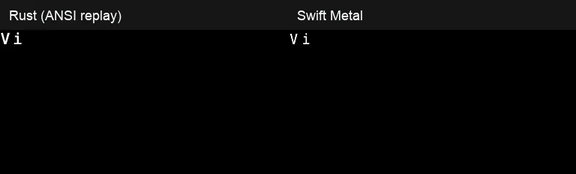

[Full pour comparison](docs/swift-port/comparisons/pour.mp4) · Inline preview: up to 6 seconds, original speed.

### print

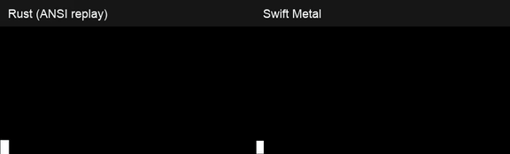

[Full print comparison](docs/swift-port/comparisons/print.mp4) · Inline preview: up to 6 seconds, original speed.

### rain

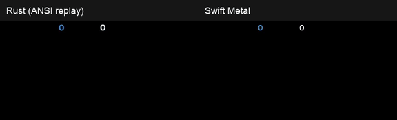

[Full rain comparison](docs/swift-port/comparisons/rain.mp4) · Inline preview: up to 6 seconds, original speed.

### randomsequence


[Full randomsequence comparison](docs/swift-port/comparisons/randomsequence.mp4) · Inline preview: up to 6 seconds, original speed.

### rings

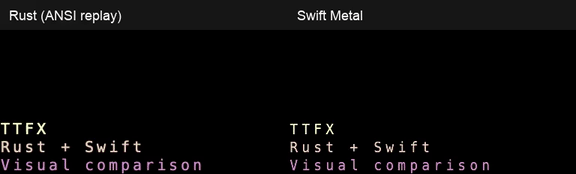

[Full rings comparison](docs/swift-port/comparisons/rings.mp4) · Inline preview: up to 6 seconds, original speed.

### scattered

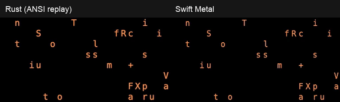

[Full scattered comparison](docs/swift-port/comparisons/scattered.mp4) · Inline preview: up to 6 seconds, original speed.

### slice


[Full slice comparison](docs/swift-port/comparisons/slice.mp4) · Inline preview: up to 6 seconds, original speed.

### slide


[Full slide comparison](docs/swift-port/comparisons/slide.mp4) · Inline preview: up to 6 seconds, original speed.

### smoke

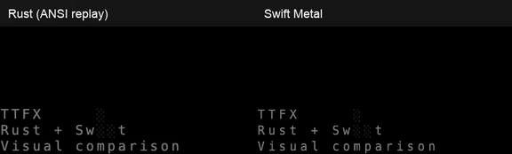

[Full smoke comparison](docs/swift-port/comparisons/smoke.mp4) · Inline preview: up to 6 seconds, original speed.

### spotlights

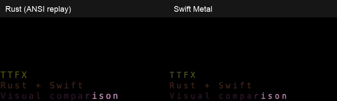

[Full spotlights comparison](docs/swift-port/comparisons/spotlights.mp4) · Inline preview: up to 6 seconds, original speed.

### spray

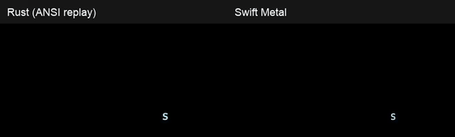

[Full spray comparison](docs/swift-port/comparisons/spray.mp4) · Inline preview: up to 6 seconds, original speed.

### swarm


[Full swarm comparison](docs/swift-port/comparisons/swarm.mp4) · Inline preview: up to 6 seconds, original speed.

### sweep


[Full sweep comparison](docs/swift-port/comparisons/sweep.mp4) · Inline preview: up to 6 seconds, original speed.

### synthgrid

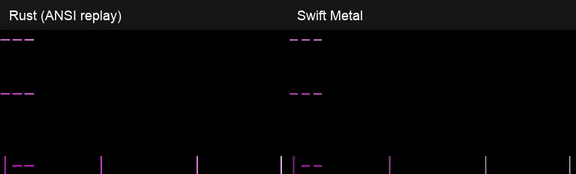

[Full synthgrid comparison](docs/swift-port/comparisons/synthgrid.mp4) · Inline preview: up to 6 seconds, original speed.

### thunderstorm


[Full thunderstorm comparison](docs/swift-port/comparisons/thunderstorm.mp4) · Inline preview: up to 6 seconds, original speed.

### unstable

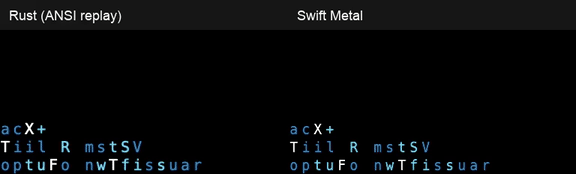

[Full unstable comparison](docs/swift-port/comparisons/unstable.mp4) · Inline preview: up to 6 seconds, original speed.

### vhstape

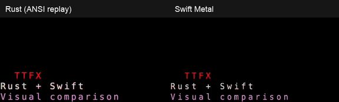

[Full vhstape comparison](docs/swift-port/comparisons/vhstape.mp4) · Inline preview: up to 6 seconds, original speed.

### waves

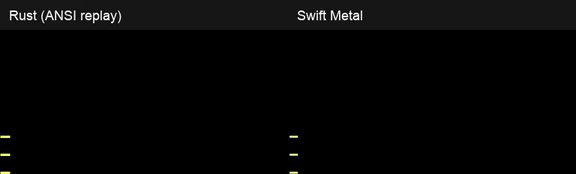

[Full waves comparison](docs/swift-port/comparisons/waves.mp4) · Inline preview: up to 6 seconds, original speed.

### wipe

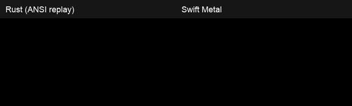

[Full wipe comparison](docs/swift-port/comparisons/wipe.mp4) · Inline preview: up to 6 seconds, original speed.

## Technical reference

The following sections preserve the implementation, operational, and verification details. Swift evidence is scoped separately from the production Rust product and its Python parity/benchmark results.

## Native Swift port

**Swift implements all 37 Rust effect counterparts (37/37 registry names match).** It remains WIP:
registered effects are not a claim of complete CLI or cross-platform parity. The measured Rust comparison
and its limits are below; the later Rust/Python fidelity and benchmark sections describe Rust, not Swift.

The native Swift work is intentionally a **port of a port**:

```text
TerminalTextEffects (Python, ChrisBuilds)
        ↓ parity port
Rust ttfx (this repository's production binary)
        ↓ native port in progress
Swift ttfx / TTFXSwiftUI / TTFXGalleryApp
```

The Swift code follows the Rust implementation rather than reimagining TTE directly. That keeps one
local oracle: Rust owns the production terminal behavior, while Swift proves itself against Rust-backed
parity tests and side-by-side visual comparison. It lives in the root Swift package and does **not**
replace the Rust `ttfx` product or change the Rust parity claims later in this reference. Status and architecture:
[`docs/swift-port/README.md`](docs/swift-port/README.md) and the
[module architecture](docs/swift-port/swift-port-architecture.md).

```sh
swift package resolve
swift build --product ttfx
printf 'Swift\nTTE' | swift run ttfx -- --canvas-width 12 --canvas-height 6 print
printf 'Swift\nTTE' | swift run ttfx -- --canvas-width 12 --canvas-height 6 print --print-speed 5
swift run ttfx -- print --help
swift run ttfx -- --print-completion bash
```

This toolchain’s `swift run` takes the executable name, not `--product`. Per-effect TTE flags
go after the effect name (`ttfx print --print-speed 5`, `ttfx rain --rain-symbols o .`).
Unknown effect flags are rejected. `ttfx <effect> --help` lists that effect’s flags.

### Gallery app setup

There are two native Swift app workflows in this repo:

| App | What it shows | How to run |
|---|---|---|
| `TTFXGalleryApp` | Live SwiftUI/Metal preview of one Swift effect at a time. You can change text, seed, canvas, effect, playback, and renderer. | `xcodegen generate && open TTFXGalleryApp.xcodeproj`, then run scheme **TTFXGalleryApp** on **My Mac** or an iOS Simulator. |
| `TTFX Video Comparison` | Four synchronized tracks: Rust terminal replay, Swift Metal, optional pure-Swift CLI, and optional SwiftUI. This is the visual parity review tool. | `./tools/video-comparison/capture.sh` once, then `./script/build_and_run.sh --compare`. |

Open the Xcode **app** project for the gallery, not the SwiftPM executable:

```sh
xcodegen generate
open TTFXGalleryApp.xcodeproj
```

Select scheme **TTFXGalleryApp** (product `TTFXGalleryApp.app`) and a destination
(**My Mac** or **iPhone Simulator**), then Run. The app bundle id is
`codes.suscodigos.ttfx.gallery`.

Do not Run the SwiftPM `TTFXGalleryApp` executable. That path is a bare binary with no
bundle id: on iPhone UIKit traps in `BKSHIDEvent`; on Mac you get `missing main bundle
identifier` and `linkd.autoShortcut` XPC errors.

The SwiftPM executable remains for `swift build --product TTFXGalleryApp` / tests. `TTFXGalleryApp`
lists `EffectRegistry.names` in registry order and lets you edit text, seed, canvas, effect, and
playback through the native SwiftUI snapshot path.

### Comparison capture and playback

The comparison app uses real project outputs, but they are generated artifacts and are intentionally
ignored by Git. A local capture library looks like this:

```text
artifacts/video-comparison/
├── manifest.json
├── provenance.json
└── print/
    ├── rust.frames
    ├── rust.mp4
    ├── swift-cli.frames
    ├── swift-cli.mp4
    ├── swiftui.mp4
    └── metal.mp4
```

Generate it before opening the app:

```sh
./tools/video-comparison/capture.sh --effect print --max-frames 240
./script/build_and_run.sh --compare
```

That command creates real local videos you can inspect outside the app too:

```sh
open artifacts/video-comparison/print/rust.mp4
open artifacts/video-comparison/print/swift-cli.mp4
open artifacts/video-comparison/print/swiftui.mp4
open artifacts/video-comparison/print/metal.mp4
```

For a full visual sweep, omit `--effect print`; that produces four videos for each of all 37 effects
(148 videos). Capture integrity checks are not proof of effect equivalence. The app opens
`artifacts/video-comparison` automatically through `./script/build_and_run.sh --compare`.

Search and select an effect, press **Play** or Space, and scrub the shared timeline. Rust terminal and
Swift Metal always stay visible; the **Optional panes** buttons independently show/hide **Swift CLI**
(⌘1) and **SwiftUI** (⌘2). Older libraries remain loadable and show missing-recording notices for
absent optional tracks. **Speed** selects 0.5×–3× and applies to all four videos, including hidden panes,
and the shared timeline. **Loop** repeats all present tracks together at the longest track endpoint,
retaining the selected speed; it defaults off. Shorter tracks hold until that shared boundary.
Turning Loop off lets the current pass finish; pause and seek remain paused.
Changing speed preserves position and pause state; timestamps remain media
seconds. Only the capture date is shown in the footer; source revision remains in the manifest.

If the app says `manifest.json` could not be opened, it means the selected/default library folder does
not contain a generated comparison library. Usually one of these happened:

- `./tools/video-comparison/capture.sh` has not been run yet on this checkout;
- the app was launched directly from Xcode or Finder without the `--library` argument, so its working
  directory was not the repository root;
- **Open Library…** was pointed at an effect folder like `artifacts/video-comparison/print` instead of
  the library root `artifacts/video-comparison`.

Fix it with:

```sh
./tools/video-comparison/capture.sh
./script/build_and_run.sh --compare
```

More detail: [`docs/swift-port/video-comparison.md`](docs/swift-port/video-comparison.md),
[`docs/swift-port/video-recording.md`](docs/swift-port/video-recording.md), and
[`docs/swift-port/video-comparison-schemas.md`](docs/swift-port/video-comparison-schemas.md).
Behavior changes require RED → GREEN → REFACTOR; see the observed toggle, selector, and playback-speed
[TDD evidence and remaining limits](docs/swift-port/video-comparison-tdd.md).

### Measured Swift parity against Rust

Verified on **2026-09-17, macOS 26.6.2 arm64, Swift 6.3.3**, at repository commit
`11e587ba781f14ea42ad929f0467ab3a6a732ea6`. Rust sources and Cargo files are unchanged from reference
`0f24d88408c8b815761c2c07da7dc9b411f63016`; the suite runs that local Rust checkout, not Python.

| Evidence | Observed result | Scope |
|---|---|---|
| `swift test --filter CompleteEffectParityTests` | **117/117 parameterized cases passed** (111 default runs + 6 timed runs; 2 test functions). | Every frame's ANSI bytes, frame count, and completion, with a 10,000-tick truncation guard. |
| Existing executable capture dumps | **37/37 Rust/Swift CLI pairs byte-identical**. | Recorded multiline sample, seed 42, 24×8 canvas, 25 FPS, virtual clock; not a full terminal session. |

The 111 runs use all 37 effects at defaults with three input/seed/canvas combinations: `TTFX\nRust + Swift\nVisual comparison` / 42 / 24×8; `Native Swift\n A B C\nParity!` / 7 / 16×6;
`Parity 2026\nSWIFT + RUST\n  Two spaces` / 123 / 18×7, all at 25 FPS. Six additional runs test
`matrix` and `thunderstorm` at 60, 17, and 0 FPS with seed 23, input `Clock test\nRust Swift`,
and a 16×6 canvas. Rust parity-dump mode and Swift effect ticks use deterministic frame-based time.
See [`CompleteEffectParityTests.swift`](tests/ttfx-effectsTests/CompleteEffectParityTests.swift).

This is **sampled default-effect parity**, not universal 37/37 parity. The full non-default configuration
corpus, Unicode/layout/ANSI preprocessing, random-selection continuation, and real terminal pacing,
resize, cancellation, and teardown still need comprehensive Rust-backed proof. The cross-platform CLI
specification's T01–T08 remain pending; macOS evidence does not certify Windows or Linux. See
[`cross-platform-cli-spec.md`](docs/swift-port/cross-platform-cli-spec.md) and
[`ODD task status`](odd/tasks/cross-platform-cli.md).

| Area | Current status |
|---|---|
| Core/effects | Native Swift core plus all 37 effect counterparts; measured full-run default cases are scoped above, not every configuration. |
| CLI | Native `ttfx` executable with Rust-style terminal options, TTE per-effect flags after the effect name, random-effect filtering, completions, and hidden parity-dump support. All 37 have parity-dump smoke coverage; the 37 existing CLI capture pairs match exactly for their recorded sample. Complete terminal/CLI parity remains pending. |
| SwiftUI/Metal | Optional `TTFXSwiftUI` library plus `TTFXGalleryApp.xcodeproj` for macOS and iOS Simulator. Production Metal presentation is implemented; local interactive gallery/comparison checks are recorded in the Swift port docs. Headless CI proves command planning, not visual appearance. |
| Product scope | The Rust binary remains the production authority in this README. The Swift port is tracked in `docs/swift-port/` and `openspec/changes/native-swift-port/`. |

```sh
swift test --filter CompleteEffectParityTests
swift test --filter EffectFrameParityTests
swift test --filter CLIParityDumpTests
swift test --filter CLIParsingTests
swift test --filter TTFXSwiftUITests
swift test --filter galleryXcodeAppDeclaresBundleIdentifierAndIOSDestinations
swift test
```

## Rust CLI usage

The production Rust product is a dependency-free terminal binary: pipe text in and pick an effect. The static Linux build command is listed below; this is not a Swift packaging claim.

```
<producer> | ttfx [terminal options] <effect> [effect options]

ttfx --help                 # all 37 effects and the terminal options
ttfx <effect> --help        # options for one effect
ttfx --random-effect        # surprise me (--include-effects / --exclude-effects to filter)
ttfx --print-completion bash|zsh
```

Terminal options (canvas size and anchoring, color handling, frame rate, text wrapping) go
before the effect name; effect options after it. Option names and defaults match `tte`, so
existing invocations work with the binary name swapped.

Pipe text into the built Rust binary:

```sh
ls -la | ttfx decrypt
cat banner.txt | ttfx beams
fortune | ttfx --random-effect
git log --oneline -10 | ttfx matrix
```

## Rust build and validation

```sh
cargo build --release
cargo build --release --target x86_64-unknown-linux-musl   # static, ~3.3 MB
```

`./bin/test` runs every suite. It needs python3, and the parity half needs a copy of
upstream, which it clones at the pinned commit on first run:

```sh
./tools/parity/fetch_reference.sh   # what bin/test calls; safe to run by hand
```

Upstream is not vendored here — the harness fetches it, because it's their code.

## Rust fidelity

This is a *parity port*, not a reimplementation-in-spirit. Given the same input, config, and
random draws, ttfx produces **byte-identical frames** to the Python original — verified
mechanically in CI against a pinned upstream checkout (v0.15.0), not by eyeballing.

| Suite | Checks | What it proves |
|---|---|---|
| `tools/parity/run_suite.sh` | 354 | every effect's frame stream, byte for byte, across configs and seeds |
| `tools/parity/tty_compare.sh` | 41 | the full terminal byte stream — canvas prep, cursor moves, teardown |
| `tools/tests/cli_corpus.sh` | 19 | exit codes and stdout/stderr routing |
| `tools/tests/*_behavior.py` | pty | what only a real terminal shows: resize restarts, signal teardown |
| `cargo test` | goldens + traces | easing/geometry/gradient values and engine state machines |

`./bin/test` runs the lot, which is all CI does.

Making that possible meant reproducing upstream's quirks deliberately, not "fixing" them:
Python's banker's rounding, gradients built from integer floor division rather than float
interpolation, a bezier arc-length approximation that drops its final segment, and looping
scenes that report themselves complete on every tick. They're catalogued in
[`plan.md`](plan.md); the places where Python's unordered iteration had to be pinned down are
in [`docs/ordering-inventory.md`](docs/ordering-inventory.md).

**Two deliberate differences.** Random number generation is not bit-compatible with CPython —
ttfx uses xoshiro256++, so `--seed` is reproducible within ttfx but won't match Python's
Mersenne Twister. (The parity harness swaps a shared PRNG into both sides, which is what makes
frame comparison possible at all.) And Python plugin effects aren't supported, since there's
no interpreter to load them.

## Rust-only benchmark background

The following recorded numbers compare **Rust ttfx with Python TTE, not Swift or Metal**.

TTE is a Python package. That's the right call for a library, but for a shell toy that lives in
your prompt pipeline it means an interpreter, an install step, and ~65 ms of import before the
first frame. ttfx is one dependency-free binary that starts in half a millisecond.

That difference is the whole reason this exists. On a fullscreen canvas the heavier effects run
out of headroom under Python. Time to render a whole animation, pacing disabled so this measures
throughput rather than `sleep()`:

| At 200×50 cells | frames | ttfx | Python TTE | ttfx fps |
|---|---|---|---|---|
| slide | 375 | 76 ms | 2,203 ms | 4,930 |
| beams | 732 | 181 ms | 5,564 ms | 4,050 |
| rings | 1,566 | 521 ms | 10,439 ms | 3,004 |
| waves | 633 | 374 ms | 8,745 ms | 1,693 |
| startup | — | 0.5 ms | 64 ms | — |

Across the 35 effects that aren't gated on wall-clock time, the median speedup is **27.5×**
(range 17.1×–47.4×). The two that are gated — `matrix` and `thunderstorm` — spend most of their
runtime in a fixed animation duration that no implementation can shorten, so they come in at
1.9× and 1.3×; what ttfx buys there is a far higher frame rate inside that window, not a shorter
one.

Reproduce it with `python3 tools/tests/bench_full.py`, or set `TTFX_BENCH_COLS`, `TTFX_BENCH_LINES`
and `TTFX_BENCH_FILL=1` for the fullscreen numbers above. Both sides run their real user-facing
command, best of five.

## Rust production scope

Linux and macOS. Built for [Omarchy](https://omarchy.org) originally; nothing targets a
specific libc, and CI runs the tests and CLI corpus on both platforms. The byte-exact
parity suites stay pinned to Linux/glibc — Apple's libm rounds a few transcendentals a
last-ulp differently, which quantization hides in real frames but a bit-exact comparison
would surface.

## Credit where it's due

**The art and behavior begin upstream with [TerminalTextEffects](https://github.com/ChrisBuilds/terminaltexteffects)
(TTE), authored by [ChrisBuilds](https://github.com/ChrisBuilds).** Every effect concept, the animation-engine
shape, and the user-facing CLI vocabulary come from TTE. If you like the effects, star and credit the original
project first.

This repository's Rust `ttfx` implementation is a parity port of TTE, copyrighted by **37signals / omacom-io**
under the same MIT license. It translates the Python engine into a single dependency-free Rust binary while
preserving TTE's frame behavior as closely as possible.

The Swift implementation is a **port of that port**: it maps the Rust engine/effects/CLI and renderer seams into
Swift modules for native apps, SwiftUI/Metal preview, and side-by-side video comparison. The Swift code uses the
Rust binary as its local oracle, and the Rust binary traces back to TTE.

TTE is MIT licensed and so are these ports; the original copyright is preserved in
[LICENSE](LICENSE) and [NOTICE](NOTICE). Please file *effect* ideas upstream, where they belong.

## License

MIT — see [LICENSE](LICENSE), which carries both this project's copyright and the original
TerminalTextEffects copyright, and [NOTICE](NOTICE) for the attribution in full.
