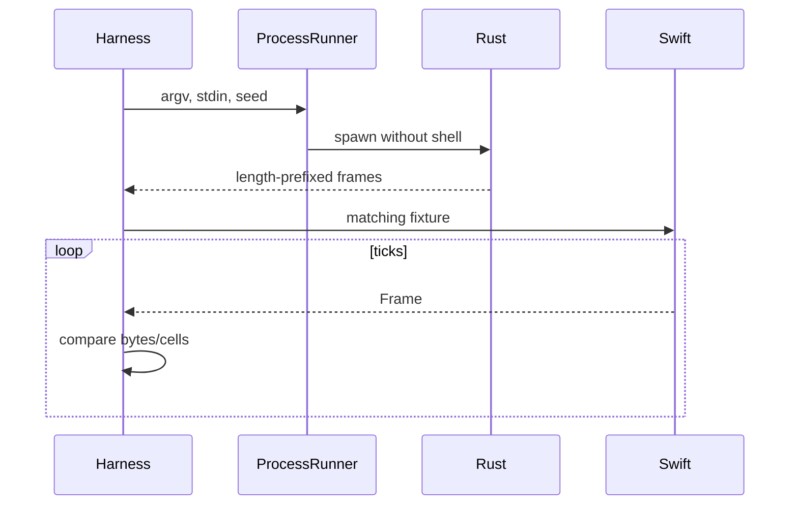

# Design: Native Swift Port of ttfx

## Technical Approach

Port the Rust pipeline behind parity-first Swift modules. The primitive substrate remains the valid base layer; mapping `print_effect`, `slide`, `wipe`, `expand`, `rain`, `bubbles`, `fireworks`, and `swarm` proves a shared composition layer is additionally required before 2.1. This corrects a technical prerequisite without changing proposal/spec scope, effect order, oracle behavior, quirks, or completion.

## Architecture Decisions

| Decision | Choice and rationale | Rejected tradeoff |
|---|---|---|
| Boundaries | Keep `TTFXCore`, `TTFXEffects`, `TTFXCLI` (`ttfx`), optional `TTFXSwiftUI`; tests import production dependencies directly. | One target hides dependency direction. |
| ANSI/oracle | Implement exact bytes in `CLI/TTFXANSI.swift`; fixtures come from a revision-pinned, argument-array `ProcessRunner`; retain only ArgumentParser. | Live Rust unit calls and the former ANSI dependency are unsafe or nondeterministic. |
| Two-level substrate | Preserve completed 2.0 value primitives: stable arena IDs/groups, visibility/layers, collisions, basic paths/holds, scenes, typed reentrant events, completion, seeded state, fixed frame capacity. Add composition centrally before effects. | Effect-local substitutes duplicate load-bearing ordering and cannot prove parity. |
| Delivery | Approved single PR/10,000-line `size:exception`; sequential work-unit gates replace stale stacking language. SwiftUI remains last/omittable. | Scope changes violate specs. |

## Composition Contracts

`AnimationSubstrate.swift` retains 2.0 models and adds stored composition state. `MotionComposition.swift` defines ordered `PathSegment` (waypoints/control points, speed, easing, hold), `PathChain`, segment cursor, activation/reset, and completion. `SceneComposition.swift` defines `SceneSync` (`none`, path progress/distance/step), resettable activation, and `SceneBuilder.gradient(symbols:durations:foreground:background:)` using core color interpolation.

`CharacterScheduling.swift` defines `CharacterSeed`, `AnimationRuntime.init(canvas:input:seed:)`, append-only `spawn`, canonical `CharacterOrder`, `CharacterGroupSequence`, per-character path assignment, and deterministic `ReleasePlan`. `RuntimeActions.swift` extends ordered registrations with `RuntimeAction` for path/scene chain, reset, visibility/layer/coordinate, and `emit(EffectEvent)`; effects drain typed values and mutate their state without stored closures.

`EffectRuntime.swift` defines `RuntimeEffect: Effect` with owned `AnimationRuntime`, `buildRuntime()`, and `scheduleTick()`. Its default `tick(into:)` schedules, updates ascending active IDs, dispatches actions inline, renders, then evaluates pending work. All random choices pass through runtime Xoshiro in request order; the scheduler never draws implicitly.

`EffectEngine → RuntimeEffect.scheduleTick → AnimationRuntime.update → Path/Scene → RuntimeActions → render → Frame`

## Strict-TDD Prerequisite

| RED seam | Required proof |
|---|---|
| Segment/chain cursor | Three waypoints and chained paths visit every segment with Rust easing, holds, reset, and event order. |
| Scene synchronization | Progress/distance/step scenes synchronize, loop, deactivate, and reset reproducibly. |
| Groups/releases | Row/column/diagonal order, delayed release, and distinct character paths match mapped traces. |
| Gradient builder | Foreground/background interpolation, symbol durations, dynamic/no-color cases, and coordinate colors match fixtures. |
| Typed actions | Chained path/scene actions and effect events dispatch inline/reentrantly without closure retention. |
| Arena initialization | Unicode input metadata and runtime-spawned anchors receive stable IDs and render/update ordering. |
| Runtime integration/RNG | A fixture effect proves build-once scheduling, exact draw trace, active pruning, completion, and fixed frame capacity. |

Place these RED→GREEN tests in `tests/ttfx-swiftTests/Core/AnimationCompositionTests.swift`; require the focused test, full `swift test`, and a seeded Rust trace fixture before 2.1. Effect tests remain RED before each GREEN implementation.

## Parity Sequence

## Threat Matrix

| Boundary | Applicability | Safe/failure behavior and planned RED tests |
|---|---|---|
| Documentation-like paths | N/A | No executable classification. |
| Git repository selection | Applicable | `git -C <absolute-root> rev-parse HEAD`; relative/absolute and non-repository tests. |
| Commit state | N/A | Identity read only. |
| Push state | N/A | No push. |
| PR commands | N/A | No automation. |
| CLI/oracle subprocess | Applicable | Fixed executable, argument arrays, allowlisted environment, timeout, captured streams; spaces/metacharacters, missing/non-executable oracle, timeout, nonzero exit, and truncated data tests; never a shell. |

## Migration / Rollout

No migration. Insert one independently verifiable composition prerequisite between completed 2.0 and 2.1; preserve effect sequence and merge only after sequential gates. Rust remains default; rollback removes Swift products.

## Open Questions

None blocking.
